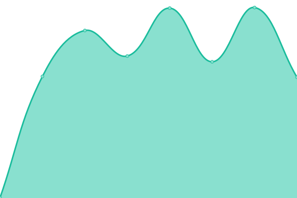
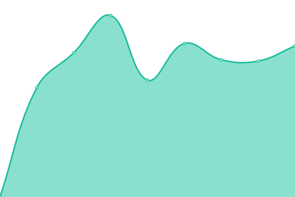

# [📈 Live Status](https://digitalnomad91.github.io): <!--live status--> **🟧 Partial outage**

This repository contains the open-source uptime monitor and status page for [Upptime](https://upptime.js.org), powered by [Upptime](https://github.com/upptime/upptime).

With [Upptime](https://upptime.js.org), you can get your own unlimited and free uptime monitor and status page, powered entirely by a GitHub repository. We use [Issues](https://github.com/upptime/upptime/issues) as incident reports, [Actions](https://github.com/digitalnomad91/upptime/actions) as uptime monitors, and [Pages](https://digitalnomad91.github.io) for the status page.

<!--start: status pages-->
<!-- This summary is generated by Upptime (https://github.com/upptime/upptime) -->
<!-- Do not edit this manually, your changes will be overwritten -->
<!-- prettier-ignore -->
| URL | Status | History | Response Time | Uptime |
| --- | ------ | ------- | ------------- | ------ |
|  [CodeBuilder, Inc.](https://codebuilder.us) | 🟥 Down | [code-builder-inc.yml](https://github.com/digitalnomad91/upptime/commits/HEAD/history/code-builder-inc.yml) | 

 823ms
     
 | 

<a href="https://digitalnomad91.github.io/upptime/history/code-builder-inc">85.74%</a>
    

|  [Subtlefuge](https://subtlefuge.com) | 🟩 Up | [subtlefuge.yml](https://github.com/digitalnomad91/upptime/commits/HEAD/history/subtlefuge.yml) | 

 621ms
     
 | 

<a href="https://digitalnomad91.github.io/upptime/history/subtlefuge">88.43%</a>
    

|  [Corbin.World](https://corbin.world) | 🟥 Down | [corbin-world.yml](https://github.com/digitalnomad91/upptime/commits/HEAD/history/corbin-world.yml) | 

 783ms
     
 | 

<a href="https://digitalnomad91.github.io/upptime/history/corbin-world">85.74%</a>
    

|  [Keep Your Boat Afloat](https://kybaproject.com) | 🟥 Down | [keep-your-boat-afloat.yml](https://github.com/digitalnomad91/upptime/commits/HEAD/history/keep-your-boat-afloat.yml) | 

 0ms
     
 | 

<a href="https://digitalnomad91.github.io/upptime/history/keep-your-boat-afloat">0.00%</a>
    

<!--end: status pages-->

[**Visit our status website →**](https://digitalnomad91.github.io)

## 📄 License

- Powered by: [Upptime](https://github.com/upptime/upptime)
- Code: [MIT](./LICENSE) © [Upptime](https://upptime.js.org)
- Data in the `./history` directory: [Open Database License](https://opendatacommons.org/licenses/odbl/1-0/)
